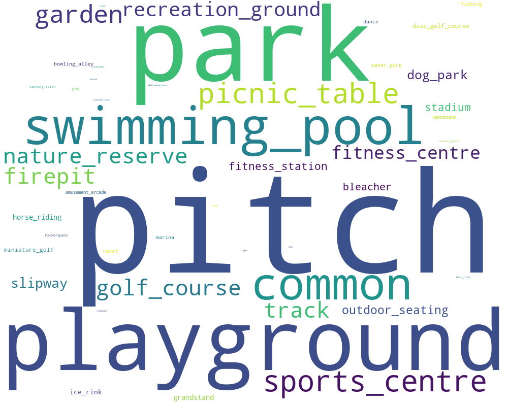
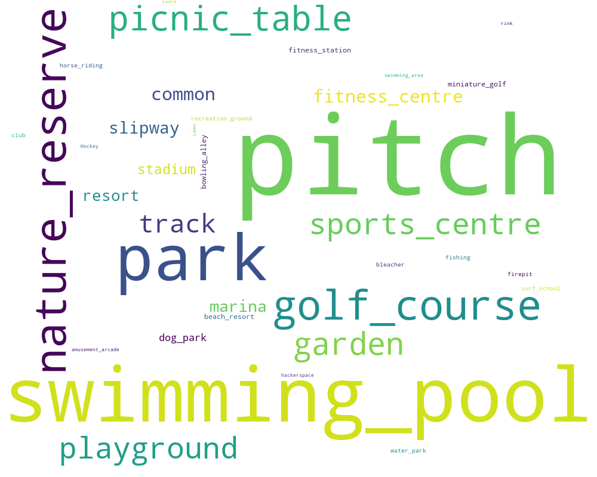

# statestats
Generate bounded statistics based on a geojson file (currently using `data/states.geojson`, but any part of the globe will work).

Uses [tile-reduce](//github.com/mapbox/tile-reduce) and [osm-qa-tiles](//osmlab.github.io/osm-qa-tiles/) to calculate OSM editing statistics at the individual mapper level for each of the US States and Territories.

_Number of buildings in OSM per state, normalized by population._ 

The final output (used to generate the above map) is `states_with_stats_normalized.geojson`. This file contains per state statistics in three ways: raw, normalized by population, or normalized by area.

## Contents

The `results` folder contains the following folders: 

| folder | contents | 
|--------|----------|
| `csv`  | A CSV file per State/Territory containing per-mapper edit counts, such as `colorado_mappers.csv` | 
| `wordclouds` | Wordclouds (images) visualizing the top 100 values for common keys, such as `amenity`, `shop`, and `leisure`. Calculated per tag, per State/Territory such as `arkansas_wordcloud_leisure.png`
| `json` | Output from tile-reduce, counts for users (`_users.json`) and tag values (`_values.json`)
| `geojson` | Per State/Territory geojson file with stats produced by tile-reduce. |

#### Individual mapper CSVs, per State. 
*counted from all OSM users/objects (that are in osm-qa-tiles), including imports*.

Here's an example of the `colorado_mappers.csv` file:

|user|building|dry_cleaning|highway|ice_cream|laundry|total_objects|
|----|--------|------------|-------|---------|-------|-------------|
|chachafish|82265|27|4418.956827547136|17|18|377082|
|Your Village Maps|23224|1|5618.477728813425|0|43|220505|
|SK53_bulk|0|0|115.33849548447466|0|0|191551|
|Skybunny|5|0|19.979800499649546|0|0|70022|
|aboges26|74|0|1627.6421876299278|0|0|68496|
|TheDutchMan13|3|0|21588.04711432218|0|0|66621|
|Mark Newnham|7267|0|11743.816325855196|0|0|66322|
|CornCO|7566|1|530.805211083113|0|0|65791|
|DavidJDBA|23682|0|11886.930341476647|0|0|64233|		
		
### Running

A python script runs `node index.js <place>` for all of the features in `data/states.geojson`.

	./run.sh 
	
This script is expecting `latest.planet-compact.mbtiles` in the parent directory.

# Wordcloud Examples

## Colorado `leisure` top values

## Hawaii `leisure` top values

